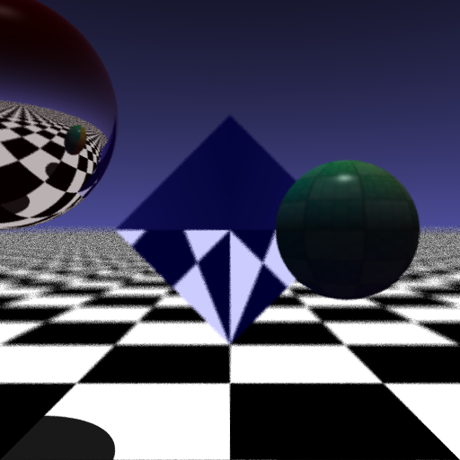

# TinyRaytracer

This is a basic raytracer written in C++.

It is heavily inspired by the great [Raycasting From Scratch](https://github.com/nikolausmayer/raytracing-from-scratch) lesson by Nikolaus Mayer.

This project was meant as a way to get familiar with C++ by using the theoretical explanations from the lesson's slides and writing my own implementation. There are many directions to explore and this project is far from being finished.

Next steps:

- Add UV Mapping
    - ~~To spheres~~
    - To other objects
- Improve positioning system (coordinates, matrices, frames, ...)
- ~~Export to other file formats (png instead of ppm)~~

Some *FUN* ideas:

- Raycasting (for a GUI editor for instance)
- Implement atmospheric diffusion.
- Add clouds

